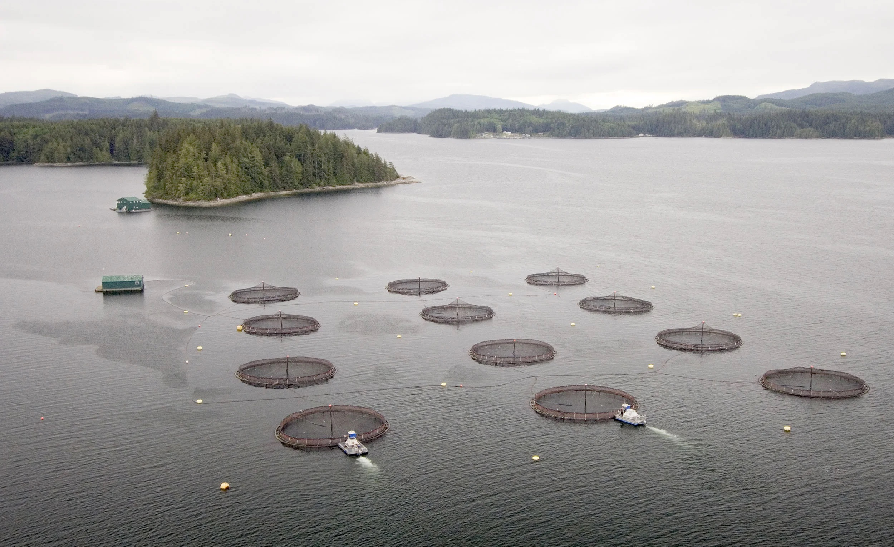

## Introduction

Freshwater aquaculture can influence lake ecosystems through nutrient enrichment, increased primary productivity, and shifts in food web structure. These ecosystem-level changes may cascade to affect fish communities, including small-bodied species such as minnows.

This report replicates and extends part of the analysis presented in "Impacts of freshwater aquaculture on fish communities: A whole-ecosystem experimental approach" by Rennie et al. (2019), which examined ecosystem responses to an experimental rainbow trout aquaculture operation conducted at the Experimental Lakes Area in Ontario, Canada. While the original study evaluates broad ecosystem responses, including nutrient dynamics and food web interactions, the present analysis focuses specifically on whether aquaculture activity influenced the abundance of minnows measured as catch-per-unit-effort (CPUE).

The study uses a Before-After Control-Impact (BACI) design comparing a treated lake, where aquaculture was implemented, with a nearby control lake. Minnow CPUE is observed across three experimental periods: before aquaculture began, during the period of active aquaculture operations, and after operations ended.

While BACI designs are widely used in ecological impact studies, they rely on the assumption that the control site provides a valid counterfactual for the treated site. In this replication, we extend the standard BACI framework by explicitly evaluating this assumption using a Difference-in-Differences (DiD) analysis. This approach allows for a more transparent assessment of whether observed changes in minnow abundance can plausibly be attributed to aquaculture activity. Because the original study focuses on ecosystem-level responses, changes in minnow abundance should be interpreted as one component of broader ecological dynamics rather than a complete measure of aquaculture impacts.

## Data Preparation

The dataset contains fish sampling observations collected from lakes within the Experimental Lakes Area. Each observation corresponds to a specific lake, year, and sampling season, and includes CPUE measurements for several fish species.

Two lakes are used in this analysis:

-   Lake 375, which served as the treatment lake where aquaculture operations were introduced

-   Lake 373, which served as a control lake

Minnow CPUE values are aggregated by lake, year, and season to produce an average abundance estimate for each sampling period. Because abundance data are often right-skewed, the CPUE values are square-root transformed prior to analysis to stabilize variance and better satisfy model assumptions.

The following code imports the dataset and constructs the variables used in the analysis.

### Data Wrangling

Key variables include:

-   treat - This variable was our predictor variable, assigned as a binary value indicating whether the lake experience aquaculture

-   period - A categorical value indicating the period of time within the study: before, during, and after aquaculture

-   season - Another catagorical variable used to differentiate sampling season between spring and fall

The combination of these variables allows us to analyze how treatment during different periods of the study influenced minnow CPUE. Additionally, separating the regressions by seasons allows for seasonal patterns to be present and not mask overall results.

```{r}
#| message: false
#| warning: false
library(tidyverse)
library(here)
library(janitor)
library(performance)
library(jtools)
library(gt)
library(gtsummary)
library(interactions)
library(car)
library(patchwork)


minnows <- read_csv(here::here("posts", "eds241-final-project", "data", "Minnows_Aquaculture_Rennie19.csv")) %>%
  janitor::clean_names()

aquaculture <- minnows %>%
  # Adding fish sp names to ambiguous columns 
  rename(
    redbell_dace   = f182,
    finescale_dace = f183,
    fathead_minnow = f209,
    pearl_dace     = f214,
    slimy_sculpin  = f382
  )  %>%
  # Drop na values from minnow column 
  drop_na(minnows) %>% 
  # Adding treatment column
  mutate(
    treat = case_when(lake == 375 ~ 1, TRUE ~ 0),
  # Add period column 
    period = case_when(
      year < 2003  ~ "Before",
      year <= 2007 ~ "During",
      TRUE         ~ "After"),
  # Reordering levels; default is alphabetical 
  period = fct_relevel(period, "Before", "During", "After"), 
  # Renaming season row names to be cleaner 
    season = case_when(season == "aSpring" ~ "Spring",
                       season == "zFall" ~ "Fall"),
  # Always order from Fall to Spring 
    season = fct_relevel(season, "Fall", "Spring"),
  sqrt_cpue = sqrt(minnows))

# Mean cpue per lake/year/season, sqrt-transformed

mean_cpue <- aquaculture %>%
  group_by(treat, year, season, period) %>%
  summarise(
    mean_cpue = mean(minnows),
    sqrt_cpue = mean(sqrt_cpue),
    .groups = "drop"
  )

# Prepare plot data
plot_data <- aquaculture %>%
  group_by(treat, year, season) %>%
  summarise(
    mean_cpue = mean(minnows),
    se_cpue   = sd(minnows) / sqrt(n()),
    .groups   = "drop"
  )
```

## Exploratory Time Series

Before estimating statistical models, it is useful to visualize how the minnow abundance changes over time in both lakes. This provides a preliminary view of whether the two lakes appear to respond differently during the aquaculture period.

```{r}

ggplot(plot_data, aes(x = year, y = mean_cpue, color = factor(treat))) +
  annotate("rect", xmin = 2003, xmax = 2007, # Highlight aquaculture period
           ymin = -Inf, ymax = Inf, fill = "grey80", alpha = 0.5) +
  annotate("text", x = 1996, label = "Aquaculture period",
           y = 400, size = 3) +
  annotate("rect", ymin = 399, ymax = 401, xmin = 2001, xmax = 2004) +
  geom_line(aes(linetype = factor(treat))) +
  geom_point(size = 2) +
  geom_errorbar(aes(ymin = mean_cpue - se_cpue,
                    ymax = mean_cpue + se_cpue), width = 0.3) +
  scale_linetype_manual(values = c("dashed", "solid"),
                        labels = c("Control", "Treated")) +
  scale_color_manual(values = c("black", "red"),
                     labels = c("Control", "Treated")) +
  facet_wrap(~ season) +
  labs(x = "Year", y = "Average catch per unit effort",
       linetype = "", color = "",
       caption = "Figure 1: Time series of average minnow CPUE for the treatment and control lakes.") +
  theme_classic()

```

In spring sampling, the treated and control lakes follow broadly similar trajectories over time, suggesting limited divergence associated with aquaculture. In contrast, fall observations exhibit greater variability with the treated lake showing more pronounced fluctuations during the aquaculture period.

These patterns suggest that potential treatment effects may be season-dependent and motivate separate analyses for spring and fall observations. They also highlight the importance of formally evaluating whether post-treatment differences reflect aquaculture impacts or pre-existing difference between lakes.

## BACI Analysis

A standard Before-After Control-Impact (BACI) analysis evaluates whether the treated site changes differently over time relative to a control site. Statistically, this is implemented using an interaction between treatment status and time period. The interaction term captures whether the change in the treated lake differs from the change observed in the control lake following the intervention.

In this framework, a significant interaction term is often interpreted as evidence of a treatment effect. However, this interpretation depends on the assumption that the control lake provides a valid counterfactual trajectory for the treated lake.

### Spring BACI Model

```{r}
spring <- mean_cpue %>%
  filter(season == "Spring") %>% # Select only spring sampling
  mutate(treat = as.factor(treat), period = as.factor(period))

mod_spring <- aov(sqrt_cpue ~ treat * period, data = spring)
summary(mod_spring)
TukeyHSD(mod_spring)
```

The spring BACI model shows no statistically significant effects of treatment, period, or their interaction. This indicates that, during spring sampling, minnow abundance in the treated lake does not change in a way that differs meaningfully from the control lake. Post-hoc comparisons from the Tukey test also fail to detect significant differences across periods. From an ecological perspective, these results provide little evidence that aquaculture activity influenced minnow abundance during the spring season.

### Fall BACI Model

```{r}
fall <- mean_cpue %>%
  filter(season == "Fall") %>% # Select only fall sampling
  mutate(treat = as.factor(treat), period = as.factor(period))

mod_fall <- aov(sqrt_cpue ~ treat * period, data = fall)
summary(mod_fall)
TukeyHSD(mod_fall)
```

In contrast, the fall BACI model yields statistically significant effects for treatment, period, and their interaction. The significant interaction indicates that minnow abundance in the treated lake changed differently over time relative to the control lake. Post-hoc comparisons suggest that this divergence is driven primarily by increases in CPUE during the aquaculture period in the treated lake. This pattern is consistent with a potential response of minnow populations to aquaculture-related changes in the lake environment, such as increased nutrient availability or altered food resources. However, this interpretation depends critically on the assumption that the treated and control lakes were following similar trajectories prior to treatment.

The fall ANOVA results can be summarized as follows:

-   `treat`: The treated lake had significantly higher fall minnow CPUE overall (treated lake was 2.60 sqrt CPUE units higher than control, p = 0.013).
-   `period`: Fall minnow abundance changed significantly over time across both lakes. During was significantly higher than Before (p = 0.006); After did not differ significantly from Before (p = 0.439).
-   `treat:period`: Lake 375 responded differently than Lake 373 across periods. The treated lake during aquaculture was significantly higher than: the control lake before aquaculture (`1:During-0:Before`, p \< 0.001), the treated lake before aquaculture (`1:During-1:Before`, p = 0.002), and the control lake during aquaculture (`1:During-0:During`, p = 0.009). The comparison `0:After-1:During` was also significant (p = 0.012), indicating a decline in the treated lake once operations ended.

### Limitations of BACI

One limitation of the traditional BACI framework is that it assumes the control site provides a valid counterfactual for the treated site. In other words, the design assumes that the treated and control lakes would have followed similar trajectories in the absence of treatment. If this assumption is violated, for example, if the lakes were already trending differently before aquaculture began, then the estimated BACI interaction could reflect those pre-existing differences rather than the effect of the intervention. Difference-in-Differences approaches make this assumption explicit through the parallel trends assumption, which requires that treated and control units exhibit similar trends prior to treatment.

## DiD: Testing Assumptions
In order to complete a Difference-in-differences analysis, a few assumptions must be met
- No spillover: Because these lakes are separated, there is no concern of aquaculture in the treated lake affecting the control lake.
- Parallel trends: The control and treatment lakes must have a similar trend of minnow CPUE prior to treatment.

### Parallel Trends Test

Restricting to the Before period only, we test whether the two lakes were already trending differently prior to aquaculture. A significant `treat:year` interaction would indicate diverging pre-treatment trends, violating the parallel trends assumption.

```{r}
pre_only <- mean_cpue %>%
  filter(period == "Before")


mod_pt <- lm(sqrt_cpue ~ treat * factor(year) + season, data = pre_only)

summary(mod_pt)
```

```{r}
pre_only %>%
  ggplot(aes(x = year, y = mean_cpue,
             color = factor(treat), linetype = factor(treat))) +
  geom_line() +
  geom_point() +
  scale_color_manual(values = c("black", "red"),
                     labels = c("Control", "Treated")) +
  scale_linetype_manual(values = c("dashed", "solid"),
                        labels = c("Control", "Treated")) +
  facet_wrap(~ season, scales = "free_y") +
  labs(x = "Year", y = "Mean cpue (fish per net days)",
       color = "Lake", linetype = "Lake",
       title = "Pre-treatment trends (parallel trends check)",
       caption = "Figure 2: Time series of pre-treatment CPUE trends between the treated and control lakes.") +
  theme_classic()

```

The coefficient of interest is the treatment-by-year interaction, which tests whether the treated lake was already trending differently before aquaculture began. In this context, the parallel trends assumption states that, in the absence of treatment, the treated lake would have followed the same trajectory as the control lake. This assumption underlies that causal interpretation of both BACI and Difference-in-Differences analysis.

The interaction between treatment and year is not statistically significant. This indicates that we fail to reject the parallel trends assumption. The accompanying time series plot (Figure 2) provides a visual check of this assumption, as the treated and control lakes appear to move in broadly similar directions before aquaculture begins. Taken together, these results provide some support for the use of the control lake as a counterfactual.

## Difference-in-Differences Analysis

Following the evaluation of parallel trends, treatment effects are estimated using a Difference-in-Differences framework. Models are estimated separately by season to account for seasonal variation in ecological responses. Unlike BACI, which compares average differences before and after treatment, the DiD approach explicitly models changes over time between treated and control units. The interaction between treatment and period represents the estimated treatment effect, capturing whether the treated lake experienced a different change in CPUE relative to the control. Separating the analysis into Before-During and Before-During-After comparisons allows us to distinguish between immediate effects of aquaculture and potential legacy effects after operations cease.

### Before and During

#### Fall

```{r}
pre_aqua_fall <- aquaculture %>%
  filter(period != "After",
         season == "Fall")

mod_did_pre_fall <- lm(sqrt_cpue ~ treat * period + factor(year), data = pre_aqua_fall)

summary(mod_did_pre_fall)

par(mfrow = c(1, 2))
plot(mod_did_pre_fall, which = 1)  # Residuals vs fitted
plot(mod_did_pre_fall, which = 2)  # QQ-plot
durbinWatsonTest(mod_did_pre_fall) # Autocorrelation

```

**Diagnostics:** The residuals vs. fitted plot shows increasing spread at higher fitted values, driven by the extreme CPUE spike during aquaculture — the sqrt transformation did not fully stabilize variance. The QQ plot confirms a heavy right tail from these outlier years. The Durbin-Watson test indicates no autocorrelation (DW = 2.23, p = 0.984).

The interaction coefficient in this model is positive and marginally significant, suggesting that minnow CPUE increased in the treated lake during aquaculture operations relative to the control lake.

#### Spring

```{r}
pre_aqua_spring <- aquaculture %>%
  filter(period != "After",
         season == "Spring")

mod_did_pre_spring <- lm(sqrt_cpue ~ treat * period + factor(year), data = pre_aqua_spring)

summary(mod_did_pre_spring)

par(mfrow = c(1, 2))
plot(mod_did_pre_spring, which = 1)  # Residuals vs fitted
plot(mod_did_pre_spring, which = 2)  # QQ-plot
durbinWatsonTest(mod_did_pre_spring) # Autocorrelation

```

**Diagnostics:** The residuals vs. fitted plot shows reasonably even spread. The QQ plot is approximately normal with minor right-tail deviation from a few high-leverage observations. The Durbin-Watson test detects mild positive autocorrelation (DW = 1.79, p = 0.01), which may slightly inflate standard error precision; however, given the non-significant treatment effect, this does not change the substantive conclusion.

The spring DiD model shows no significant treatment effect during the aquaculture period (`treat:periodDuring`, p = 0.175), consistent with the spring BACI result. This supports the conclusion that aquaculture did not alter minnow abundance in spring, likely due to high overwinter mortality resetting abundance before spring sampling each year.

#### Robustness Check

##### Adjusting the window
The robustness check shifts the period boundaries (Before: pre-1996, During: 1996–2004) to assess sensitivity to the period definition.
```{r}
pre_aqua_fall_mod <- aquaculture %>% 
  mutate(period = case_when(
      year < 1996  ~ "Before",
      year <= 2004 ~ "During",
      TRUE ~ "After")) %>%
  filter(period != "After",
         season == "Fall") 

mod_did_pre_fall_mod <- lm(sqrt_cpue ~ treat * period + factor(year), data = pre_aqua_fall_mod)

summary(mod_did_pre_fall_mod)
```

```{r}
pre_aqua_spring_mod <- aquaculture %>% 
  mutate(period = case_when(
      year < 1996  ~ "Before",
      year <= 2004 ~ "During",
      TRUE ~ "After")) %>%
  filter(period != "After",
         season == "Spring") 

mod_did_pre_spring_mod <- lm(sqrt_cpue ~ treat * period + factor(year), data = pre_aqua_spring_mod)

summary(mod_did_pre_spring_mod)
```

Under this alternative window, the fall treatment effect (`treat:periodDuring`) is no longer significant (p = 0.291), and the spring effect remains non-significant (p = 0.890). Results are therefore sensitive to how the aquaculture window is defined, which warrants caution in interpretation.

##### Buffer
Remove observations of transition years between starting and stopping aquaculture.
```{r}
pre_aqua_fall_buff <- aquaculture %>%
  filter(period != "After",
         season == "Fall",
         year != 2003 & year != 2008) # Remove year aquaculture began and ended

mod_did_pre_fall_buff <- lm(sqrt_cpue ~ treat * period + factor(year), data = pre_aqua_fall_buff)

summary(mod_did_pre_fall_buff)
```

```{r}
pre_aqua_spring_buff <- aquaculture %>%
  filter(period != "After",
         season == "Spring",
         year != 2003 & year != 2008)

mod_did_pre_spring_buff <- lm(sqrt_cpue ~ treat * period + factor(year), data = pre_aqua_spring_buff)

summary(mod_did_pre_spring_buff)
```

Excluding the transition years 2003 and 2008, the buffer specification strengthens the fall treatment effect (`treat:periodDuring`, p = 0.003), while the spring result remains non-significant (p = 0.245). This suggests the fall effect is robust to the inclusion of transition-year noise.

### Before and After

#### Fall

```{r}
all_aqua_fall <- aquaculture %>% 
  filter(season == "Fall")

mod_did_all_fall <- lm(sqrt_cpue ~ treat * period, data = all_aqua_fall)

summary(mod_did_all_fall)

par(mfrow = c(1, 2))  # 1 row, 2 columns
plot(mod_did_all_fall, which = 1)
plot(mod_did_all_fall, which = 2)

durbinWatsonTest(mod_did_all_fall)

```

**Diagnostics:** The residuals vs. fitted plot shows heteroscedasticity at higher fitted values, consistent with the extreme aquaculture-period CPUE values. The QQ plot has a heavy right tail from these same observations. The Durbin-Watson test indicates no autocorrelation (DW = 1.96, p = 0.488).

The fall Before and After model shows a significant treatment effect during aquaculture (`treat:periodDuring`, p \< 0.001), consistent with the Before and During results. The post-aquaculture interaction (`treat:periodAfter`, p = 0.685) is not significant, suggesting that any treatment effect did not persist after operations ended.

#### Spring

```{r}
all_aqua_spring <- aquaculture %>% 
  filter(season == "Spring")

mod_did_all_spring <- lm(sqrt_cpue ~ treat * period + factor(year), data = all_aqua_spring)

summary(mod_did_all_spring)

par(mfrow = c(1, 2))
plot(mod_did_all_spring, which = 1)
plot(mod_did_all_spring, which = 2)
durbinWatsonTest(mod_did_all_spring)

```

**Diagnostics:** The residuals vs. fitted plot shows roughly constant spread. The QQ plot shows slight right-tail deviation. The Durbin-Watson test detects positive autocorrelation (DW = 1.70, p \< 0.001), which may modestly inflate standard error precision; this is noted further in the Critical Evaluation, and does not alter the non-significant results.

Neither the during-aquaculture (`treat:periodDuring`, p = 0.153) nor post-aquaculture (`treat:periodAfter`, p = 0.545) interaction terms are significant in spring, consistent with all prior spring results.

#### Robustness Check

##### Adjusting the window

```{r}
all_aqua_fall_mod <- aquaculture %>%
  filter(season == "Fall") %>% 
  mutate(period = case_when(
      year < 1996  ~ "Before",
      year <= 2004 ~ "During",
      TRUE ~ "After"))

mod_did_all_fall_mod <- lm(sqrt_cpue ~ treat * period + factor(year), data = all_aqua_fall_mod)

summary(mod_did_all_fall_mod)
```

```{r}
all_aqua_spring_mod <- aquaculture %>%
  filter(season == "Spring") %>% 
  mutate(period = case_when(
      year < 1996  ~ "Before",
      year <= 2004 ~ "During",
      TRUE ~ "After"))

mod_did_all_spring_mod <- lm(sqrt_cpue ~ treat * period + factor(year), data = all_aqua_spring_mod)

summary(mod_did_all_spring_mod)
```

Under the alternative period window, neither the fall nor spring treatment effects are significant across any period comparison, consistent with the Before and During robustness check.

##### Buffer

```{r}
all_aqua_fall_buff <- aquaculture %>%
  filter(period != "After",
         season == "Fall",
         year != 2003 & year != 2008) # Remove year aquaculture began and ended

mod_did_all_fall_buff <- lm(sqrt_cpue ~ treat * period + factor(year), data = all_aqua_fall_buff)

summary(mod_did_all_fall_buff)
```

```{r}
all_aqua_spring_buff <- aquaculture %>%
  filter(period != "After",
         season == "Spring",
         year != 2003 & year != 2008) # Remove year aquaculture began and ended

mod_did_all_spring_buff <- lm(sqrt_cpue ~ treat * period + factor(year), data = all_aqua_spring_buff)

summary(mod_did_all_spring_buff)
```

Excluding transition years, the fall treatment effect during aquaculture remains significant (`treat:periodDuring`, p = 0.003), while spring remains non-significant (p = 0.245). The post-aquaculture interaction is non-significant in both seasons, indicating no lasting legacy effect once operations ended.

## Rennie et al. 2019 Critical Evaluation

Standard BACI designs test whether a treated site changes more than a control site following an intervention, but they rely on an implicit assumption that the control site provides a valid counterfactual trajectory. If the treated and control lakes were already diverging prior to aquaculture, the BACI interaction term could mistakenly attribute that divergence to the treatment effect.

The results suggest that any treatment effect is both season-specific and temporally limited. Evidence of increased minnow abundance during aquaculture is observed in the fall but not in the spring, and this effect does not persist after aquaculture operations end. This seasonal asymmetry is ecologically plausible and aligns with the broader ecosystem responses documented by Rennie et al. (2019), where increased nutrient inputs during aquaculture altered productivity and food availability, potentially benefiting forage fish during certain time of year.

## Addition of Difference-in-Differences
This analysis strengthens the traditional BACI framework by incorporating a Difference-in-Differences perspective and explicitly evaluating the assumptions required for causal interpretation. The parallel trends test makes this assumption explicit and allows it to be evaluated using pre-treatment data. The absence of a statistically significant treatment-by-year interaction suggests that we fail to reject the parallel trends assumption, meaning there is no strong evidence of differential trends prior to aquaculture. 

Another important strength of this analysis is the separation of the aquaculture period into distinct phases. Traditional BACI approaches collapse all post-treatment observations into a single "after" category, which can obscure differences between short-term and longer term responses. By estimating separate DiD models for the during-treatment and post-treatment periods, this analysis distinguishes between immediate effects of aquaculture and potential legacy effects after operations cease.

Finally, this analysis added robustness checks which were largely missing from the original analysis. 

**However, several important limitations remain:**

-   The study includes only a single treated lake. With no replication at the treatment level, it is not possible to fully separate treatment effects from lake-specific dynamics. As a result, the findings should be interpreted as evidence consistent with an aquaculture effect rather than definitive causal proof. In addition, the limited number of observations reduces statistical power, making it more difficult to detect smaller or more gradual treatment effects.

-   There are model-based limitations. Diagnostic tests indicate heteroscedasticity and occasional deviations from normality, particularly in fall models driven by extreme CPUE values during the aquaculture period. Evidence of mild autocorrelation in the spring models suggest that standard errors may be somewhat underestimated, which could affect inference, although this does not alter the substantive conclusions given the lack of significant effects in spring.

-   Finally, the robustness checks demonstrate that results are sensitive to modeling choices, including the definition of treatment periods and the inclusion of transition years. While the fall treatment effect remains detectable under some specifications, it weakens or disappears under others, reinforcing the need for cautious interpretation.

Despite these limitations, the combination of visualization, BACI modeling, parallel trends testing, and Difference-in-Differences analysis provides a coherent and transparent evaluation of the aquaculture experiment.

Overall, the results illustrate how combining BACI designs with a DiD framework can strengthen causal interpretation in ecological impact studies. While the analysis is limited by the presence of only a single treatment lake, the parallel trends test and the separation of during- and post-treatment periods provide a more transparent evaluation of how aquaculture activity may influence fish community dynamics.

## Conclusion

This analysis provides partial evidence that freshwater aquaculture influenced minnow abundance in the treatment lake, with increases observed during the aquaculture period in fall sampling but not in spring. These effects appear to be short-lived, as there is no strong evidence that difference between the treated and control lakes persist after aquaculture operations end. By extending the BACI framework with a Difference-in-Differences perspective and explicitly evaluating the parallel trends assumption, this study offers a more rigorous and transparent approach to causal inference than a standard BACI analysis alone. The results highlight the importance of testing underlying assumptions and considering temporal structure when interpreting ecological impact studies. At the same time, the findings should be interpreted in the broader context of the ecosystem-level experiment conducted by Rennie et al. (2019). Minnow abundance represents only one component of the lake food web, and observed changes likely reflect underlying shifts in nutrient dynamics and productivity associated with aquaculture activity.

Overall, this analysis illustrates both the potential and the limitations of applying quasi-experimental methods in ecological systems. While the results are consistent with a short-term aquaculture effect on forage fish abundance, the lack of replication and sensitivity to modeling choices limit the strength of causal claims. Future work incorporating additional treated systems or longer time series would improve statistical power and strengthen inference and provide a more complete understanding of how aquaculture influences freshwater ecosystems.
